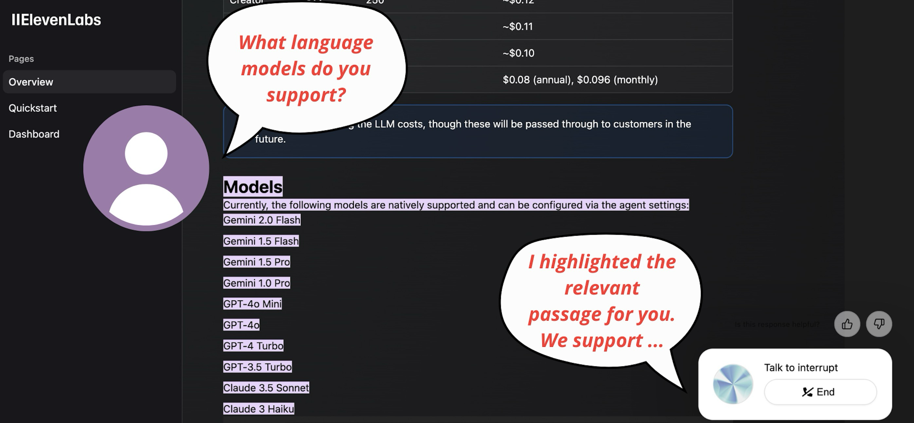

# Project Overview

## TITLE: Mark.ai  



### PROBLEM  
Conversational AI generates inaccurate (hallucinated) responses, leading to low user trust.  

### SOLUTION  
AI Agent which scrolls and highlights relevant content that directly addresses the user's query.  

### VALUE PROPOSITION  
- Build user trust in AI-generated responses.  
- Save time and minimize effort needed to navigate documentation.  

---

# Team  

- **Wojciech Mroczyński** – Prompt engineering, backend development  
- **Marko Golovko** – Full stack development  

---

# Technical Details  

### TECH STACK  
- **Conversational AI** – ElevenLabs (agent widget)  
- **Next.js** – Full stack app  
- **Text Fragments** – Cross-browser standard; LLM using it via tool calling to scroll & highlight relevant text on the currently viewed webpage  

## Quick Start

```bash
cp .env.example .env
```

Edit the `.env` file with your ElevenLabs API key, and PostHog variables for analytics.

```bash
npm install
npm dev
```

## Learn More

To learn more about ElevenLabs, take a look at the following resources:

- [ElevenLabs Documentation](https://elevenlabs.io/docs) - learn about ElevenLabs features and API.
